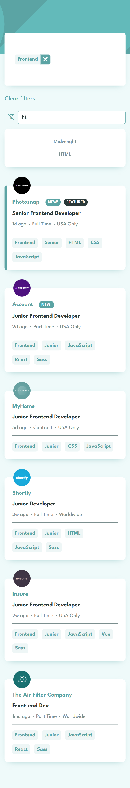
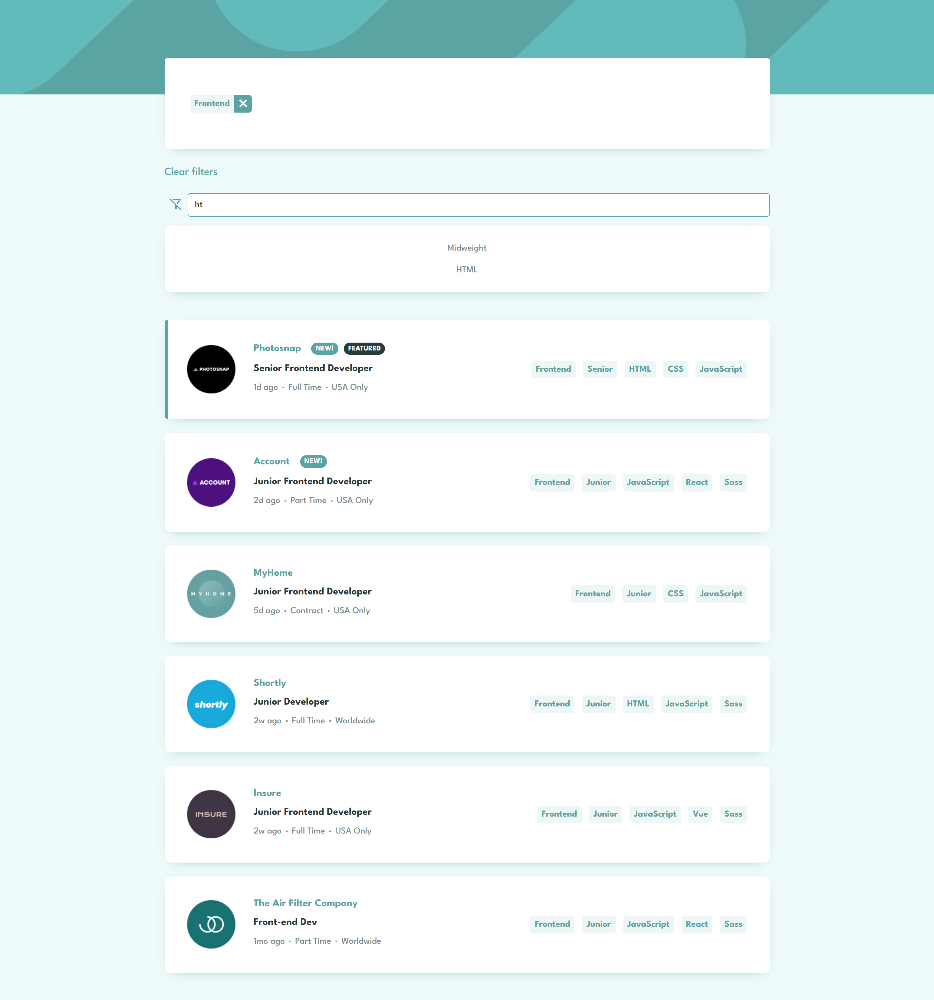

# Frontend Mentor - Job listings with filtering solution

Hello!

Firstly, I'd like to thank you for taking your time to review my project. This is a solution to the [Job listings with filtering challenge on Frontend Mentor](https://www.frontendmentor.io/challenges/job-listings-with-filtering-ivstIPCt) challenge from Frontend Mentor.

## Table of contents

- [Overview](#overview)
  - [The challenge](#the-challenge)
  - [Screenshot](#screenshot)
  - [Built with](#built-with)

**Note: Delete this note and update the table of contents based on what sections you keep.**

## Overview

In a nutshell, this is a simple app which allows users to browse through and filter available job offers. For enchanged accessibility, it is possible to move through the entire app using keyboard only and it is possible to trigger the same events with keyboard as with mouse.

It was built with React.js, TypeScript and SCSS.

The job listings are stored in a Firebase database and fetched from there. The fetching function is embedded inside of a setTimeout() function, so that the users are able to see the loading animations (setTimeout would be removed if it was a professional app, but I decided to use it for improved visual purposes).

Once the initial data is loaded, it can be filtered. Users will receive appropriate feedback if they are trying to sort the list using incorrect values or if there are no job positions that would match provided filter rules.

Overall state management is handled by redux - there are two separate reducers for rendering the jobs list and handling filters.

### The challenge

Users are able to:
- View loading states while the data is fetched from Firebase.
- View error message if the data fails to be loaded.
- Apply filters by either entering the filter value inside of an input and pressing enter, browsing through the filters list and pressing and enter while focused on a keyword or by simply clicking on the desired keyword.
- Remove already added filters one by one or all at once.
- Users will receive errors if they are trying to filter with an empty input or incorrect value.
- Users will receive feedback when there are no filters that would match provided input value.
- Users will receive feedback when there are no job offers that would match provided filters.
- The app is accessible - users are able to fully interact with it using keyboard only and see focus and hover states for all interactive elements.
- View the optimal layout for the site depending on their device's screen size.

### Screenshots

Mobile view:

Desktop view:

### Built with

- Semantic HTML5 markup
- SCSS
- TypeScript
- React.js
- React Redux
- Firebase
- Mobile-first workflow
- Focused on accessibility